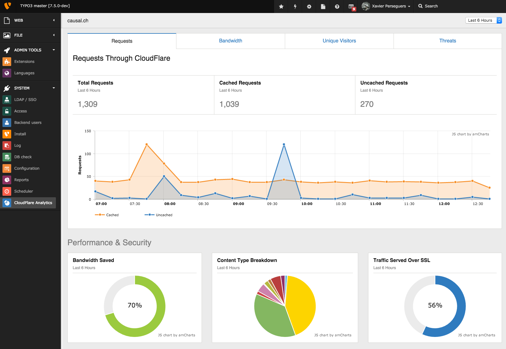
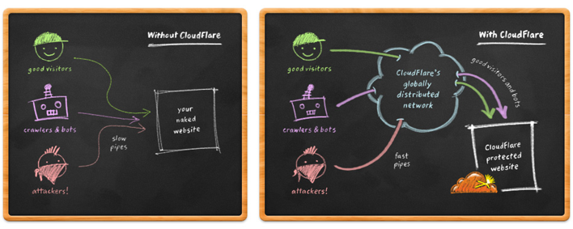

.. ==================================================
.. FOR YOUR INFORMATION
.. --------------------------------------------------
.. -*- coding: utf-8 -*- with BOM.

.. include:: ../Includes.txt

.. _introduction:

Introduction
============

.. _what-it-does:

What does it do?
----------------

This extension ensures your TYPO3 website is running optimally on the Cloudflare
platform. With it, you receive:

- Correct IP address information for visitors
- Better protection against common vectors of attacks

Things you need to know:

- The main purpose of this extension is to ensure you have no change to your
  originating IPs when using Cloudflare. Since Cloudflare acts as a reverse
  proxy, connecting IPs now come from Cloudflare's range. This extension will
  ensure you can continue to see the originating IP [#]_.

- In addition, this extension lets you benefit from Cloudflare's caching
  mechanism transparently and will automatically flush the cache for you, when
  it is needed.

- This extension lets you manage multiple domains on Cloudflare, just as TYPO3
  does, and lets you easily toggle "Development Mode" from TYPO3 Backend
  whenever Cloudflare's optimizations should be temporarily bypassed.

Finally, it provides a handy dashboard as a Backend module featuring some
analytics.

   Backend module featuring Cloudflare analytics for your domain(s) over a
   configurable period of time.

.. _what-is-cloudflare:

What is Cloudflare?
-------------------

Cloudflare protects and accelerates any website online. Once your website is a
part of the Cloudflare community, its web traffic is routed through their
intelligent global network. They automatically optimize the delivery of your web
pages so your visitors get the fastest page load times and best performance.
They also block threats and limit abusive bots and crawlers from wasting your
bandwidth and server resources. The result: Cloudflare-powered websites see a
significant improvement in performance and a decrease in spam and other attacks.

   System overview with and without Cloudflare.

Cloudflare's system gets faster and smarter as their community of users grows
larger. They have designed the system to scale with their goal in mind: helping
power and protect the entire Internet.

Cloudflare can be used by anyone with a website and their own domain, regardless
of your choice in platform. From start to finish, setup takes most website
owners less than 5 minutes. Adding your website requires only a simple change to
your domain's DNS settings. There is no hardware or software to install or
maintain and you do not need to change any of your site's existing code. If you
are ever unhappy you can turn Cloudflare off as easily as you turned it on.
Their core service is free and they offer enhanced services for websites who
need extra features like real time reporting or advanced SSL protection.

Read more on: https://www.cloudflare.com/.

.. rubric:: Footnotes

.. [#] TYPO3 lets you fix it but as they are numerous proxy servers, the
   configuration may be tedious. The best method is to restore the originating
   IP at the Web Server level but sometimes this is not possible. This is the
   reason why, in addition to flushing cache on Cloudflare, this extension lets
   the user restore the originating IP by ticking a configuration checkbox.
