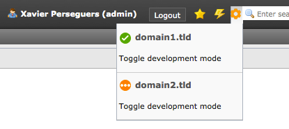

.. ==================================================
.. FOR YOUR INFORMATION
.. --------------------------------------------------
.. -*- coding: utf-8 -*- with BOM.

.. include:: ../../Includes.txt

.. _users-manual-development-mode:

Toggling development mode
-------------------------

A monochrome gear icon in the toolbar lets you manage your domains / zones:

Development mode is a way for you to make changes to your site, and see the
changes immediately. By entering development mode, you will bypass Cloudflare's
proxy and suppress minification. As a result, as you make changes to images, CSS
or Javascript, the changes will appear immediately. Development mode stays on
for three (3) hours and then automatically toggles off.

The gear icon shows a badge with the number of zones in development mode (if
greater than 0).
